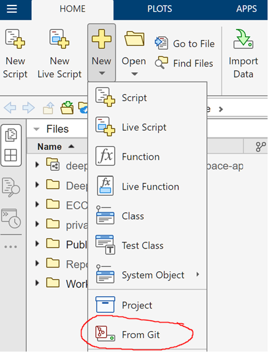

# AI Workshop for Space Applications
## Using CubeSat Images for Pose Estimation

### Instructions for Tutorial at AAS GNC 2024

### **STEP 1:** Access MATLAB Online

Click on the following link to access MATLAB Online. You will need to log in using your MathWorks account. If you do not already have an account, you can create a new one for free.

**Link:** [https://www.mathworks.com/licensecenter/classroom/4308902/](https://www.mathworks.com/licensecenter/classroom/4308902/)

### **STEP 2** Clone Tutorial Files into MATLAB Online

After accessing MATLAB Online and opening the MATLAB Online editor, clone the tutorial project using the From Git option as in the image below.

Use the following cloning link:

